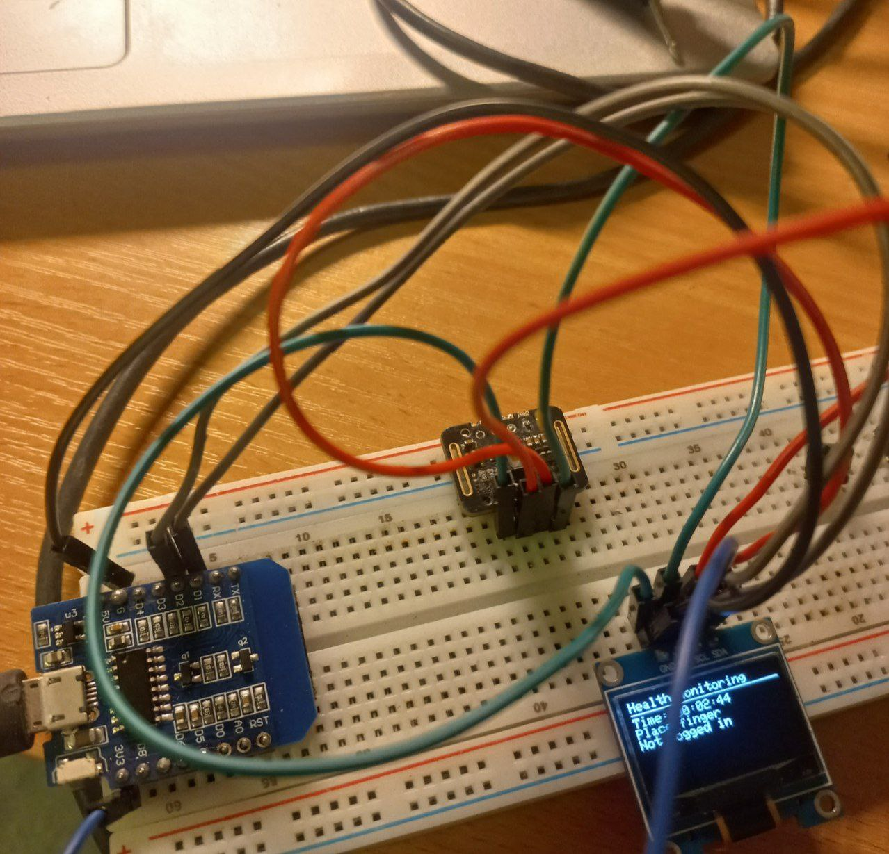

# пульсоксиметр и мониторинг здоровья

## Описание проекта

Проект представляет собой прототип устройства — пульскосиметр, предназначенных для мониторинга состояния здоровья пользователя, отображения времени и управления будильником. Устройство построено на базе микроконтроллера **ESP8266 D1 Mini**, оснащено OLED-дисплеем для вывода информации и сенсором **MAX30102** для измерения пульса и уровня кислорода в крови (SpO₂). Также устройство имеет веб-интерфейс.

## Цель проекта

Разработка доступного прототипа пульсоксиметра, а также с интерфейсом для установки будильника и отображением текущего времени. Получение опыта

## Задачи

- Реализовать считывание данных с сенсора MAX30102;
- Отображать данные пульса, SpO₂ и времени на OLED-дисплее;
- Разработать веб-интерфейс для управления будильником;
## 🛠 Компоненты

| Компонент              | Кол-во | Назначение                            |
|------------------------|--------|----------------------------------------|
| ESP8266 D1 Mini        | 1      | Микроконтроллер (интернет, логика)     |
| OLED 128x64 I2C        | 1      | Отображение информации                 |
| MAX30102               | 1      | Сенсор пульса и SpO₂                   |               |
| Макетная плата/пайка   | 1      | Сборка финального устройства           |

## 🖼 Фото устройства

### Сборка на макетной плате:

### Интерфейс:

## ⚙ Используемые технологии и инструменты

- Язык программирования: **Arduino C++**
- Среда разработки: **Arduino IDE**
- Библиотеки:
  - `Adafruit_GFX`, `Adafruit_SSD1306` — для работы с OLED
  - `Wire` — I2C-интерфейс
  - `ESP8266WiFi`, `ESPAsyncWebServer` — веб-интерфейс
  - `MAX3010x` / `MAX30105` — работа с сенсором
- GitHub — для хранения кода

## Проблемы и трудности

- Работа с MAX30102 требует калибровки и фильтрации сигналов, что усложняет точные измерения пульса.
-  При активации датчика время на экране "замирает" — проблема с блокирующим кодом чтения сенсора.
-  Проблема в целом с пайкой
- Проблемы с микроконтроллером

## 🔗 Ссылка на репозиторий

 [GitHub проекта](https://github.com/Ve-Po/healthmonitor)
